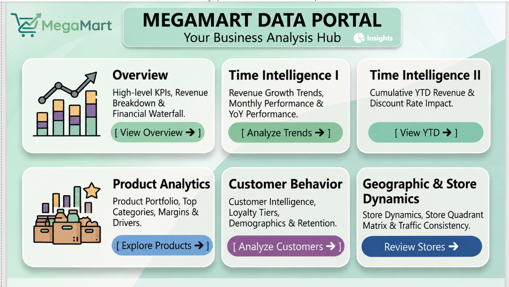
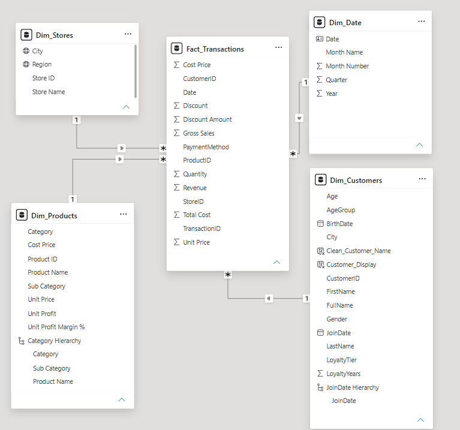
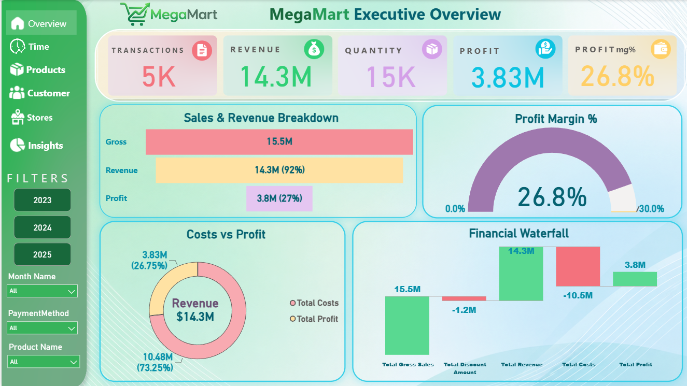
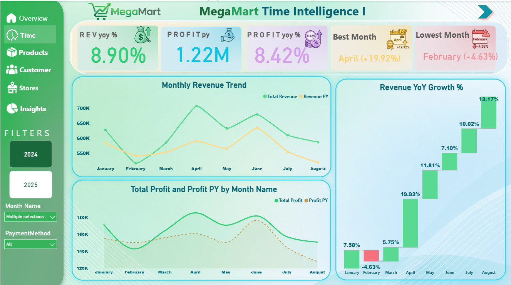
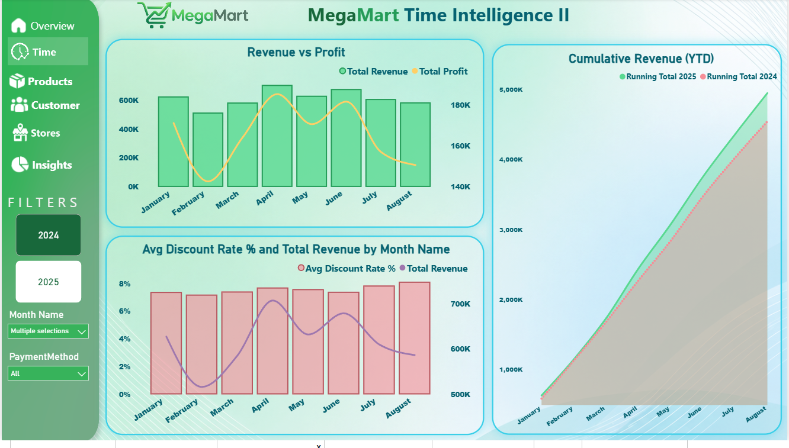
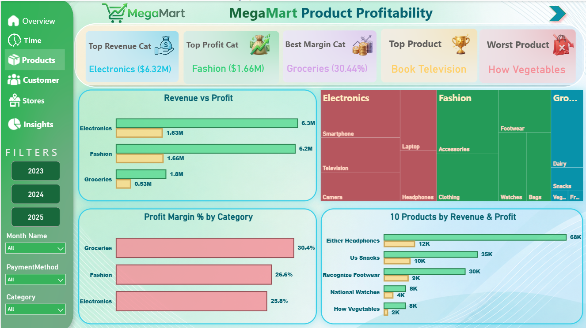
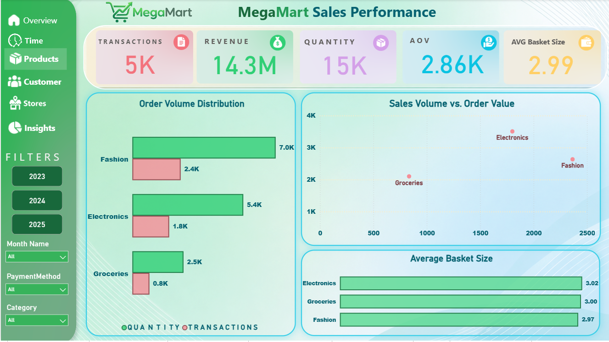
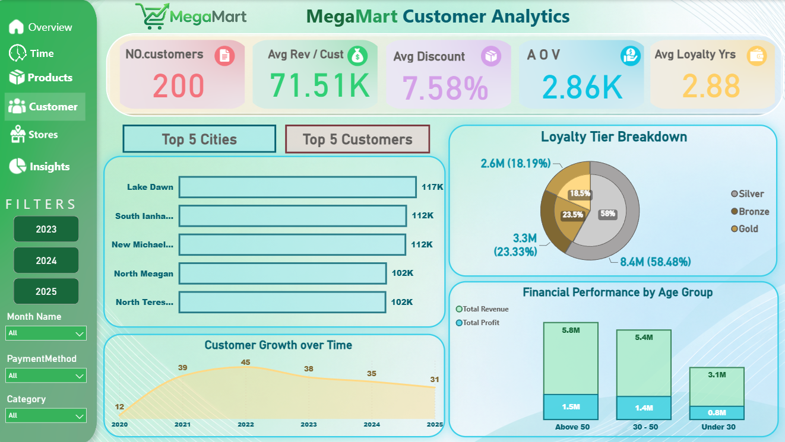
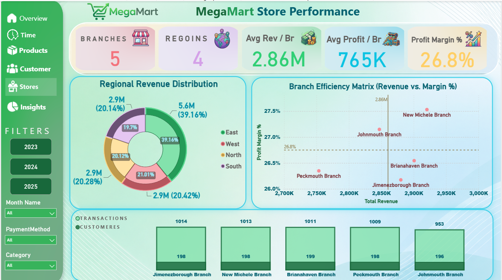
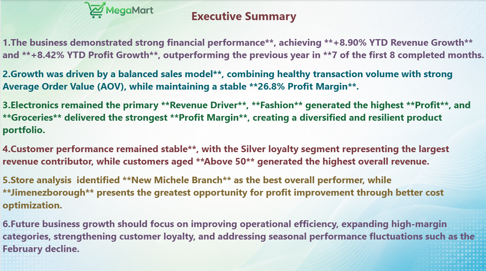

# # Retail Sales Analytics | End-to-End Business Intelligence Project


An end-to-end Business Intelligence solution built with Microsoft Power BI, Power Query, DAX, and Excel to transform raw retail sales data into actionable business insights.

---

## Dashboard Preview



---

## Project Overview

Retail Sales Analytics is an end-to-end Business Intelligence project that transforms raw retail sales data into an interactive analytical solution using Microsoft Power BI.

The project demonstrates the complete BI workflow, starting from data preparation in Excel, performing ETL using Power Query, designing a Star Schema data model, creating reusable DAX measures, and finally delivering interactive dashboards that provide actionable business insights.

The solution focuses on helping decision-makers monitor sales performance, profitability, customer behavior, product performance, and store efficiency through dynamic KPIs and interactive reports.

---

# Business Problem

Retail businesses generate large volumes of transactional data every day. Although this data contains valuable information, it cannot directly answer strategic business questions without proper transformation and analysis.

Decision-makers need a centralized reporting solution capable of answering questions such as:

- Which products generate the highest revenue?
- Which categories are the most profitable?
- Which stores perform better than others?
- How does current performance compare with previous periods?
- How do customers behave across different segments?
- Which business areas require management attention?

This project converts raw transactional data into meaningful business insights that support data-driven decision-making.

---

# Project Objectives

The project aims to:

- Build a complete Business Intelligence solution using Microsoft Power BI.
- Clean and transform raw retail data using Power Query.
- Apply ETL best practices.
- Design a Star Schema for efficient reporting.
- Develop reusable DAX measures.
- Create dynamic KPI dashboards.
- Analyze sales, products, customers, stores, and time trends.
- Deliver business insights supported by data.

---

# Solution Workflow

```text
Raw Retail Data
        │
        ▼
Excel Data Preparation
        │
        ▼
Power Query (ETL)
        │
        ▼
Star Schema Modeling
        │
        ▼
DAX Measures
        │
        ▼
Interactive Dashboards
        │
        ▼
Business Insights
        │
        ▼
Business Recommendations
```

---

# Dataset Overview

The project is built on a retail sales dataset consisting of:

- Fact Table containing **5,000 sales transactions**
- Customer Dimension
- Product Dimension
- Store Dimension
- Date Dimension

The final analytical model follows a Star Schema design to improve performance, simplify relationships, and support advanced analytical calculations.

---

# Tools & Technologies

| Category | Technology |
|-----------|------------|
| Business Intelligence | Microsoft Power BI |
| Data Preparation | Microsoft Excel |
| ETL | Power Query |
| Data Modeling | Star Schema |
| Calculations | DAX |
| Documentation | Markdown |
| Version Control | Git & GitHub |

---

# Skills Demonstrated

- Data Cleaning
- Data Transformation
- ETL Development
- Data Modeling
- Star Schema Design
- DAX Development
- KPI Design
- Dashboard Development
- Time Intelligence
- Business Analysis
- Data Visualization
- Business Intelligence

---

# Dashboard Pages

The report contains **9 interactive pages**.

| Dashboard | Purpose |
|------------|---------|
| Landing Page | Report navigation |
| Executive Overview | High-level business KPIs |
| Time Intelligence Overview | Year-over-Year analysis |
| Time Intelligence YTD vs PY | Running totals and historical comparison |
| Product Profitability | Product and category analysis |
| Sales Performance | Revenue and transaction analysis |
| Customer Analytics | Customer behavior and loyalty |
| Store & Geographic Performance | Store and regional comparison |
| Executive Summary | Final business insights and recommendations |

---

# Data Model




---

# ETL Process

Data preparation was performed using **Power Query**, where the raw retail data was transformed into a clean and structured analytical model before loading it into Power BI.

The ETL process focused on improving data quality, enriching business information, and preparing the dataset for efficient reporting and DAX calculations.

## Customer Dimension (Dim_Customers)

The customer table was transformed by:

- Importing the raw customer dataset.
- Correcting data types.
- Creating a **Full Name** column by combining first and last names.
- Calculating customer age from the birth date.
- Grouping customers into Age Groups.
- Calculating Loyalty Years based on the join date.
- Creating Loyalty Tier classifications using conditional logic.

These transformations enabled customer segmentation and loyalty analysis throughout the report.

---

## Product Dimension (Dim_Products)

The product table was enriched by:

- Validating data types.
- Creating **Unit Profit**.
- Calculating **Profit Margin (%)** for each product.
- Preparing product attributes for profitability analysis.

These calculations support category comparison, margin analysis, and product ranking.

---

## Store Dimension (Dim_Stores)

Store data preparation included:

- Cleaning text values.
- Removing unnecessary spaces using Trim and Clean.
- Standardizing city and region values.

These steps ensured accurate filtering and relationship integrity.

---

## Fact_Transactions

The transaction table represents the core fact table of the model.

Additional calculated columns were created including:

- Gross Sales
- Discount Amount
- Revenue
- Total Cost

These calculated values became the foundation for business KPIs and DAX measures.

---

## Date Dimension

A dedicated Date table was generated dynamically using the minimum and maximum transaction dates.

The table includes:

- Year
- Month Number
- Month Name
- Quarter

The Date dimension enables Time Intelligence calculations including Previous Year comparison, Running Totals, and Year-over-Year Growth.

---

# Data Modeling

After completing the ETL process, the data model was designed using a **Star Schema**.

The model consists of a centralized fact table connected to multiple dimension tables.

### Fact Table

- Fact_Transactions

### Dimension Tables

- Dim_Customers
- Dim_Products
- Dim_Stores
- Dim_Date

The Star Schema improves:

- Query performance
- Filter propagation
- DAX simplicity
- Model scalability
- Dashboard responsiveness

---

# DAX Strategy

Business calculations were implemented using reusable DAX measures organized into Display Folders for easier maintenance and navigation.

The measures were grouped according to their analytical purpose.

## Base Measures

Core business KPIs including:

- Revenue
- Profit
- Costs
- Quantity
- Transactions
- Gross Sales
- Discount Amount
- Profit Margin

---

## Average & Performance Measures

Business performance indicators including:

- Average Order Value (AOV)
- Average Basket Size
- Average Revenue per Store
- Average Profit per Store
- Average Revenue per Customer
- Average Loyalty Years
- Average Discount Rate

---

## Time Intelligence

Advanced analytical calculations including:

- Revenue Previous Year
- Profit Previous Year
- Revenue YoY Growth
- Profit YoY Growth
- Running Total
- Best Growth Month
- Lowest Growth Month

---

## Product Performance

Measures used for product ranking and profitability analysis.

Including:

- Top Revenue Category
- Top Profit Category
- Highest Margin Category
- Top Selling Product
- Lowest Performing Product

---

# Dashboard Design Approach

The dashboards were designed following an executive reporting approach.

Each page answers a specific business question while maintaining consistent colors, navigation, KPI placement, and interactive filtering.

The report allows users to navigate between summary and detailed analysis while preserving context across pages.

---

# Key KPIs

The report tracks multiple business KPIs including:

- Total Revenue
- Total Profit
- Total Transactions
- Total Quantity
- Profit Margin %
- Average Order Value
- Average Basket Size
- Average Revenue per Customer
- Average Revenue per Store
- Average Profit per Store
- Total Customers
- Total Active Stores
- Revenue YoY Growth
- Profit YoY Growth

---

# Dashboard Walkthrough

## 1. Landing Page


The Landing Page serves as the entry point to the report, providing a clean navigation experience across all dashboard pages.

### Purpose

- Simplify report navigation.
- Improve user experience.
- Provide quick access to each analytical section.

---

## 2. Executive Overview



The Executive Overview presents a high-level snapshot of business performance through the most important executive KPIs.

### KPIs

- Total Transactions
- Total Revenue
- Total Quantity
- Total Profit
- Profit Margin %

### Business Value

This page enables management to quickly evaluate the overall business performance before exploring detailed analysis.

---

## 3. Time Intelligence Overview



This dashboard focuses on Year-over-Year business performance and growth trends.

### KPIs

- Revenue YoY Growth %
- Profit Previous Year
- Profit YoY Growth %
- Best Growth Month
- Lowest Growth Month

### Business Value

Helps management monitor annual growth, identify seasonal trends, and evaluate overall business performance over time.

---

## 4. Time Intelligence (YTD vs PY)



This page compares cumulative business performance against the previous year using running totals.

### Analysis Includes

- Running Total
- Previous Year Comparison
- Revenue Trend
- Profit Trend

### Business Value

Supports long-term performance evaluation and enables early identification of positive or negative growth patterns.

---

## 5. Product Profitability



This dashboard evaluates product and category performance based on revenue, profitability, and sales volume.

### KPIs

- Top Revenue Category
- Top Profit Category
- Highest Margin Category
- Top Selling Product
- Lowest Performing Product

### Business Value

Allows management to identify high-performing products, optimize product strategy, and improve profitability.

---

## 6. Sales Performance



This page focuses on sales activity and purchasing behavior.

### KPIs

- Transactions
- Revenue
- Quantity
- Average Order Value (AOV)
- Average Basket Size

### Business Value

Provides insight into customer purchasing behavior and overall sales efficiency.

---

## 7. Customer Analytics



Customer Analytics explores customer value, loyalty, and purchasing behavior.

### KPIs

- Total Customers
- Average Revenue per Customer
- Average Discount Rate
- Average Order Value
- Average Loyalty Years

### Business Value

Supports customer segmentation and helps identify opportunities to improve customer retention and lifetime value.

---

## 8. Store & Geographic Performance



This dashboard compares the performance of stores across different geographic regions.

### KPIs

- Total Active Stores
- Number of Regions
- Average Revenue per Store
- Average Profit per Store
- Profit Margin %

### Business Value

Highlights operational differences between branches and supports regional performance evaluation.

---

## 9. Executive Summary



The Executive Summary consolidates the project's most important findings and strategic recommendations.

### Purpose

- Summarize business performance.
- Highlight key analytical findings.
- Present actionable recommendations.

This page provides decision-makers with a concise overview of the project's conclusions without reviewing the entire report.

---

# Key Business Insights

The analysis uncovered several business insights that go beyond reporting raw numbers and provide actionable findings for decision-makers.

## Revenue vs Profitability

Although the Electronics category generated the highest revenue, profitability analysis showed that Fashion achieved the highest overall profit.

This demonstrates that revenue alone is not a sufficient indicator of business success and highlights the importance of evaluating both revenue and profitability when making strategic decisions.

---

## Sales Trend Analysis

Year-over-Year analysis indicated positive business growth across the reporting period.

However, Drill Down analysis identified a noticeable decline during February, which was primarily driven by lower Smartphone sales.

This finding demonstrates how interactive analysis can quickly identify the underlying cause of performance changes.

---

## Customer Behavior

Customer analysis showed that revenue differences were influenced more by the number of active customers than by significant differences in average customer spending.

Loyalty analysis also provided additional insight into long-term customer value and retention opportunities.

---

## Product Performance

Product analysis revealed clear differences between sales volume, profitability, and profit margins.

Some products generated high revenue but relatively lower profitability, while others produced stronger margins despite lower sales volume.

These findings support better pricing and product portfolio decisions.

---

## Store Performance

Store comparison highlighted performance variations between branches.

While some branches generated stronger revenue, others demonstrated higher profitability and operational efficiency.

Geographic analysis allows management to identify high-performing locations and recognize branches that may require additional operational improvements.

---

# Business Recommendations

Based on the analytical findings, the following recommendations can support future business performance:

- Focus marketing efforts on high-profit product categories rather than revenue alone.
- Investigate the decline in Smartphone sales identified during February.
- Expand successful strategies used by the highest-performing stores.
- Improve product mix by balancing revenue generation with profitability.
- Continue monitoring customer loyalty metrics to improve customer retention.
- Use Year-over-Year KPIs to track long-term business growth.

---

# Repository Structure

```
Retail-Sales-Analytics/
│
├── Dataset/
│   └── Raw Retail Dataset
│
├── Excel/
│   ├── Retail Analysis.xlsx
│   └── Retail Data Model.xlsx
│
├── Images/
│   ├── 00-Landing-Page.png
│   ├── 01-Executive-Overview.png
│   ├── 02-Time-Intelligence-Overview.png
│   ├── 03-Time-Intelligence-YTD-vs-PY.png
│   ├── 04-Product-Profitability.png
│   ├── 05-Sales-Performance.png
│   ├── 06-Customer-Analytics.png
│   ├── 07-Store-Geographic-Performance.png
│   ├── 08-Executive-Summary.png
│   └── 09-Data-Model-Star-Schema.png
│
├── Documentation/
│   ├── ETL_Power_Query_Documentation.md
│   └── Project_Walkthrough.md
│
├── Retail_Sales_Dashboard.pbix
├── Retail_Sales_Dashboard.pdf
├── README.md
├── LICENSE
└── .gitignore
```

---

# How to Run

1. Clone or download this repository.
2. Open the Power BI project file (`Retail_Sales_Dashboard.pbix`).
3. If prompted, update the data source paths to match the files in the `Dataset` folder.
4. Refresh the data model.
5. Explore the report using the navigation buttons and slicers.

---

# Skills Demonstrated

This project demonstrates practical experience in:

- Business Intelligence
- Data Cleaning
- ETL Development
- Power Query
- Data Modeling
- Star Schema Design
- DAX
- Time Intelligence
- KPI Development
- Dashboard Design
- Business Analysis
- Data Storytelling

---
## Technologies


---


# Acknowledgments

This project was developed as part of my Business Intelligence portfolio to demonstrate end-to-end analytical skills using Microsoft Power BI.

The project covers the complete workflow from raw data preparation to business insights and executive reporting.

---

## License

This project is licensed under the MIT License.
